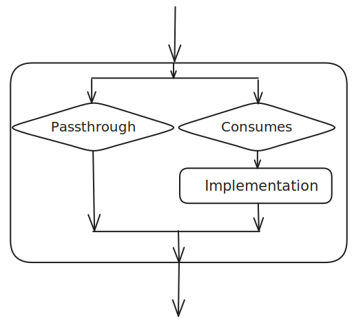

###########
Using Tasks
###########

Tasks are the fundamental unit of behavior in a DV-Flow specification. Tasks
accept data from tasks that they depend on, and produce data to be used by
dependent tasks. Tasks may have local parameters to control operation.

The implementation of a task is required to perform three key tasks:

* Compute dependencies -- Specifically, determine whether the task must
  perform work. Tasks typically save a 'memento' with the system that
  is used by future evaluations of the task.
* Perform work -- The task implementation must perform the desired
  data transformation when required. Usually this involves invoking
  another tool, such as a compiler. When work is performed, the task
  may produce markers to communicate the location of errors, warnings,
  or other key information.
* Produce output -- Tasks are required to pass data output data
  to their successor tasks independent of whether the task performed
  a data transformation.

Most tasks are built on top of another existing task or tasks.These
'derived' tasks either modifiy the `parameters` of the base task
to cause it to behave as desired, or compose multiple tasks together
to achieve the desired functionality.

Specifying the Base Task
========================
Each defined task has a unique identity. Typically, though, the required 
behavior is very similar to that of an existing task. As a consequence,
it is very common to define a task in terms of another. This is
done via the `uses` clause.

.. code-block:: yaml
    
    tasks:
    - name: PrintHello
      uses: std.Message

The example above creates a new task named `PrintHello` that
inherits the parameters and implementation of the existing
`std.Message` task. 

Specializing Task Parameters
============================
The simplest way to leverage existing tasks is to customize the
value of parameters that control the behavior of the base task.
Let's take a look at the `std.Message` task. This task displays
a user-specified message string. By default, the message is empty. 

.. code-block:: yaml
    
    tasks:
    - name: PrintHello
      uses: std.Message
      with:
        msg: Hello, World!

The example above creates a new task named `PrintHello` that 
overrides the value of the `msg` parameter. This causes 
the implementation of `std.Message` to print 'Hello, World!'.

Specifying Dependencies
=======================
Most tasks operate on data produced by other tasks. The `needs` clause
specifies the tasks that must complete before this task can execute.

.. code-block:: yaml
    
    tasks:
    - name: rtlfiles
      uses: std.FileSet
      with:
        type: "verilogSource"
        base: "rtl"
        include: "*.v"
    - name: sim
      uses: hdlsim.vlt.SimImage
      needs: [rtlfiles]
      with:
        top: [mytop]
    - name: run
      uses: hdlsim.vlt.SimRun
      needs: [sim]

The example above shows three tasks that:

* Gather verilog source files from the `rtl` directory
* Compile the files into a simulation image 
* Run the simulation image

Data passes between each pair of steps above:

* `rtlfiles` outputs a list of sources files required to create a simulation image
* The sim-image task passes a path to the simulation image to the task that runs it

In addition, one step cannot proceed until the proceeding step has completed. These
scheduling and dataflow requirements are captured using `needs` relationships.

Tasks and Dataflow
==================
Task `needs` relationships specify dataflow between tasks in addition to 
scheduling dependencies. A task provides two controls over what input
data is provided to the task implementation (if present) and what inputs
are forwarded to the output. 

The two controls are:

* **consumes** - Specifies what input data will be passed to the implementation

  * **all** - All input data is passed to the implementation
  * **none** - No input data is passed to the implementation
  * *list of patterns* - Only inputs matching one of the patterns are passed to the implementation.
    Each pattern is a dictionary where all key-value pairs must match the data item's attributes.
* **passthrough** - Specifies what inputs are passed to the task output

  * **all** - All input data is passed to the output
  * **none** - No input data is passed to the output
  * **unused** - Inputs that are not consumed are passed to the output
  * *list of patterns* - Only inputs matching one of the patterns are passed to the output.
    Each pattern is a dictionary where all key-value pairs must match the data item's attributes.

The default value of `passthrough` is **unused**. The default value for 
`consumes` is **all**.

Dataflow Examples
-----------------

**Example 1: Using passthrough to control output**

When a task doesn't consume any inputs but should still forward them to dependent tasks:

.. code-block:: yaml

    tasks:
    - name: file1
      uses: std.CreateFile
      with:
        filename: "file1.txt"
        content: "content1"
    - name: file2
      uses: std.CreateFile
      with:
        filename: "file2.txt"
        content: "content2"
    - name: collector
      needs: [file1, file2]
      passthrough: all
      consumes: none

In this example, the `collector` task doesn't consume any inputs (`consumes: none`)
but passes all inputs through to tasks that depend on it (`passthrough: all`).

**Example 2: Pattern matching with consumes**

When a task should only consume specific data items based on their attributes:

.. code-block:: yaml

    tasks:
    - name: rtl_files
      uses: std.FileSet
      with:
        type: "verilogSource"
        base: "rtl"
        include: "*.v"
    - name: tb_files  
      uses: std.FileSet
      with:
        type: "verilogSource"
        base: "tb"
        include: "*.sv"
    - name: sim
      uses: hdlsim.vlt.SimImage
      needs: [rtl_files, tb_files]
      consumes:
        - type: "std.FileSet"

In this example, the `sim` task only consumes data items of type `std.FileSet`. 
The `consumes` parameter is a list of patterns, where each pattern is a dictionary.
A data item matches if all key-value pairs in the pattern match the item's attributes.

**Example 3: Selective passthrough with patterns**

When a task should only pass through specific types of data:

.. code-block:: yaml

    tasks:
    - name: producer
      uses: hdlsim.vlt.SimImage
      # Produces FileSet items with different filetypes
    - name: filter
      needs: [producer]
      passthrough:
        - type: "std.FileSet"
          filetype: "verilogInclude"
        - type: "std.FileSet"
          filetype: "simLib"
      consumes: none

In this example, the `filter` task doesn't consume any inputs but only passes through
`FileSet` items that have `filetype` of either `verilogInclude` or `simLib`. Other 
inputs from `producer` are not passed to tasks depending on `filter`.

**Example 4: Combining passthrough and consumes**

The `unused` passthrough mode automatically passes through inputs that were not consumed:

.. code-block:: yaml

    tasks:
    - name: files
      uses: std.FileSet
      with:
        base: "src"
        include: "*.txt"
    - name: options
      uses: hdlsim.SimElabArgs
      with:
        args: ["--trace"]
    - name: sim
      needs: [files, options]
      consumes:
        - type: "hdlsim.SimElabArgs"
      # passthrough defaults to 'unused'
      
In this example, `sim` consumes only the `SimElabArgs` items. The default `passthrough: unused`
means the unconsumed `FileSet` items are automatically passed through to tasks that depend on `sim`.

Using DataItem Tasks
==================== 

Tasks generally produce output data. That output data may be produced by the
task's programming-language implementation (ie Python) when computation of
some form is required. When no computation is required, there is concise way
to produce a data item: define a task that `uses` a data type as the base.
This is most commonly done when producing a data item that captures a set 
of tool options.

.. code-block:: yaml

    tasks:
    - name: SimOptionsTrace
      uses: hdlsim.SimElabArgs
      with:
        args: [--trace-fst]

    - name: sim_img
      uses: hdlsim.vlt.SimImage
      needs: [SimOptionsTrace]

The `SimOptionsTrace` task above will produce a single `hdlsim.SimElabArgs` data
item that instructs the `Verilator` simulator to enable dumping a FST-format 
waveform file. 

This has the same effect as adding `--trace-fst` directly on the `sim_img` task, 
but provides more flexibility:

* Tasks can be defined with commonly-used sets of options
* Conditional task execution can be used to select between option sets

Using Compound Tasks
====================

Compound tasks allow a task to be defined in terms of a set 
of subtasks. In many cases, this allows more-advanced behavior
to be created without the need to provide a programming-language
implementation for the task.

.. code-block:: yaml

    tasks:
    - name: CreateSVFiles
      rundir: inherit
      body:
      - name: mod1
        uses: std.CreateFile
        with:
            filename: mod1.sv
            content: |
                module mod1;
                endmodule
      - name: mod2
        uses: std.CreateFile
        with:
            filename: mod2.sv
            content: |
                module mod2;
                endmodule
      - name: getFiles
        uses: std.FileSet
        passthrough: none
        needs: [mod1, mod2]
        with:
            type: "verilogSource"
            base: "."
            include: "*.sv"

The compound task above uses the `std.CreateFile` task to create 
two SystmeVerilog files. We then want to pass both files on to
all tasks that depend on CreateSVFiles. 

This is accomplished by:

* Specifying that all tasks use the same run directory via the
    `rundir: inherit` clause. 
* Causing the `getFiles` to depend on the file-creation tasks

Conditional Tasks
=================

By default, all tasks on the `needs` dependency path from the root task(s) will be
executed. In some cases, though, it is desirable to only execute tasks under specific
circumstances. The `iff` property of  tasks supports this use model.

.. code-block:: yaml

    package:
      name: my_ip
      with:
        debug_level:
          type: int
          value: 0
    
      tasks:
      - name: SimOptions
        uses: hdlsim.SimElabArgs
        body:
        - name: SimOptionsDebug
          uses: hdlsim.SimElabArgs
          iff: ${{ debug_level > 0 }}
          with:
            args: [--trace-fst]

      - name: sim_img
        uses: hdlsim.vlt.SimImage
        needs: [SimOptions]

The example above uses conditional execution to customize elaboration options. 
When the `debug_level` parameter's value is greater than 0, the `SimOptionsDebug` task
sends the `--trace-fst` option to the simulator. Otherwise, no additional arguments are
provided.

